**Version : 1.1**  
**Date : 21 avril 2025**  
**Auteur : Sammy Dieleman**  
**Statut : A reviser**  

---

# Table des matières

1. [Présentation du projet](#1-présentation-du-projet)  
2. [Fonctionnalités du système de gestion de contenu](#2-fonctionnalités-du-système-de-gestion-de-contenu)  
3. [Conception visuelle](#3-conception-visuelle)  
4. [Spécifications techniques](#4-spécifications-techniques)  
5. [Livrables attendus et planning](#5-livrables-attendus-et-planning)  
6. [Critères d’évaluation et normes de code](#6-critères-dévaluation-et-normes-de-code)  
7. [Ressources recommandées](#7-ressources-recommandées)  
8. [Conseils et bonnes pratiques](#8-conseils-et-bonnes-pratiques)  

---

# 1. Présentation du projet

## 1.1 Objectif :  
Créer un site web dynamique où le contenu peut être modifié facilement via une interface d’administration sécurisée, sans toucher directement au code HTML.

## 1.2 Objectifs d’apprentissage :  
- Comprendre la structure d’un projet web complet  
- Maîtriser l’architecture MVC  
- Intégrer frontend et backend  
- Adopter les bonnes pratiques de documentation  
- Identifier les points critiques en production

## 1.3 Durée du projet
Environ 80 heures réparties en 4 semaines (conception, développement, tests, déploiement).  
[Plan du projet](more/step_by_step.md)

---

# 2. Fonctionnalités du système de gestion de contenu

[Tag, themes, categories](more/tag-theme-category.md)

## 2.1 Admin
- Création, publication et mise à jour d’item (articles, produits ou tout autre type de contenu)
- Classification multi‑critères via un système de tags personnalisables  
- Accès et droits d’administration sécurisés, réservés aux utilisateurs autorisés  

## 2.2 Frontend
- Navigation fluide par catégories et par tags, pour retrouver rapidement tout type de contenu  
- Hiérarchisation thématique garantissant une cohérence éditoriale au sein du site   
- Affichage dynamique des contenus associés (articles, produits, collections) selon les filtres sélectionnés  

## 2.3 Interaction utilisateur ciblée
- Formulaire de contact avec validation serveur  
- Réception et traitement des messages par les administrateurs  
- Création et gestion de collections personnelles

## 2.4 Collections et personnalisation
- Paniers d’achats temporaires ou persistants  
- Wishlists pour achats futurs  
- Système de favoris et de likes  
- Sauvegarde des préférences utilisateur

## 2.5 Analyse des tendances
- Journalisation des recherches (`search`)  
- Analyse des intérêts via collections et likes  
- Tableaux de bord pour optimisation éditoriale

## 2.6 Liste complète des fonctionnalités frontend
[Voir la liste détaillée](duty_to_do_front.md)

## 2.7 Liste complète des fonctionnalités admin

**Consigne Générale sur la mise en œuvre**

La partie backend doit rester la plus simple possible : l’utilisation d’un template existant est permise. Si aucun template ne convient, fournir un prototype hybride (wireframe + maquette) du dashboard et du formulaire de création/édition d’item.

### 2.7.1. Tableau de Bord
- **Vue d’ensemble** : totaux clés (contenus publiés, messages non lus)  
- **Liste des items par date d’ajout décroissante**  
- **Actions rapides** :  
  - Créer un contenu  
  - Consulter les messages  

### 2.7.2. Authentification
- Connexion sécurisée  
- Hashage des mots de passe (`password_hash()`)  

### 2.7.3. Gestion des Contenus et des Catégories
- CRUD contenus  
- CRUD tags & catégories  
- Association / dissociation contenus ↔ tags / catégories  
- Génération automatique de slugs  
- Vue des contenus par tag / catégorie  
- Gestion des médias  

### 2.7.4. Gestion des Messages
- Liste des messages (formulaire contact)  
- Tri (date, statut lu/non‑lu)  
- Vue détaillée  
- Marquage du statut (lu/non‑lu)  
- Suppression  

---

# 3. Conception visuelle

## 3.1 Éléments visuels :  
- Palette de couleurs claire et sombre  
- Typographie lisible (Google Fonts)  
- Iconographie cohérente (FontAwesome, Heroicons)

## 3.2 Wireframes :  
- Wireframe  des écrans clés (accueil, détail, admin)  
- Flux de navigation et hiérarchie visuelle

## 3.3 Composants d’interface :  
- Cartes, boutons et formulaires réutilisables  
- Transitions CSS subtiles
- États (hover, actif, désactivé) clairement définis

---

# 4. Spécifications techniques

## 4.1 Architecture logicielle
Pattern MVC, séparation claire des responsabilités, modules réutilisables.

## 4.2 Structure de la base de données

**Table `item` :**  
- `id` INT AUTO_INCREMENT, PK  
- `title` VARCHAR(255) UNIQUE  
- `slug` VARCHAR(255) UNIQUE  
- `short_description` TEXT  
- `content` LONGTEXT  
- `main_image` VARCHAR(255)  
- `status` ENUM('draft','published','archived')  
- `created_at` DATETIME  
- `updated_at` DATETIME  
- `created_by` INT FK→`operator`.`id`

**Autres tables requises:**  
- `operator` : administrateurs et clients
- `tag` : catégories de contenu  
- `item_tag` : relation n–n entre `item` et `tag`  
- `message` : formulaires de contact  
- `collection` : listes de favoris, paniers, wishlists  
- `collection_item` : relation n–n entre `collection` et `item`  
- `search` : journalisation des recherches

---

## 4.3 Sécurité
- Requêtes préparées (protection SQLi)  
- Hashage sécurisé des mots de passe (bcrypt)
- Validation et échappement des entrées (XSS)  
- Protection CSRF sur tous les formulaires
- Politique CSP
  
### [En savoir plus](/more/security.md)

**Optionnels**
- RBAC (rôles et permissions détaillés)
- Journalisation des accès et actions critiques  
- Verrouillage de compte après 5 échecs de connexion

## 4.4 Performances et optimisation
- Index appropriés en base de données  
- Chargement asynchrone des ressources non critiques

## 4.5 Stockage local
- Utilisation de `localStorage` pour le thème et les favoris  
- Durée de conservation : 30 jours, quota et fallback IndexedDB

---

# 5. Livrables attendus et planning
- Code source complet (répertoire Git)  
- Schéma de base de données et jeu de données de test couvrant tous les cas d’usage  
- Documentation : guide d’installation, manuel utilisateur, documentation technique  
- Site fonctionnel déployé sur environnement de test  
- Rapport de tests (unitaires, fonctionnels, d’accessibilité)

---

# 6. Critères d’évaluation et normes de code

## 6.1 Critères d’évaluation
- Fonctionnalités complètes et robustes  
- Interface ergonomique et responsive  
- Respect des délais et qualité de la documentation

## 6.2 Normes de code 
- **PHP :** PSR‑12, PHP 8.1+  
- **JavaScript :** ES6+, ESLint (standard)  
- CI/CD via GitHub Actions (lint, tests, déploiement)

---

# 7. Ressources recommandées

## 7.1 Environnement de développement
- [XAMPP](https://www.apachefriends.org/index.html)  
- [Visual Studio Code](https://code.visualstudio.com/) ou autre éditeur  
- [Git](https://git-scm.com/doc)  
- [GitHub Copilot](https://github.com/features/copilot)  
- [Postman](https://www.postman.com/)  
- [Figma](https://www.figma.com/)  
- [phpMyAdmin](https://www.phpmyadmin.net/)  
- [W3C Validator](https://validator.w3.org/)  
- [WAVE Accessibility Tool](https://wave.webaim.org/)

## 7.2 Technologies à utiliser 
- [HTML5](https://developer.mozilla.org/fr/docs/Web/HTML)  
- [CSS3](https://developer.mozilla.org/fr/docs/Web/CSS)  
- [JavaScript](https://developer.mozilla.org/fr/docs/Web/JavaScript)  
- [PHP](https://www.php.net/docs.php) 8.1+  
- [MySQL](https://dev.mysql.com/doc/) ou [MariaDB](https://mariadb.org/)  
- [PDO](https://phpdelusions.net/pdo) (version française et mise à jour)  
- [GIT](https://git-scm.com/doc)

## 7.3 Librairies autorisées 
- Aucune sans accord préalable  
- FontAwesome, Feather Icons, Lucide, Heroicons, Phosphor Icons, Iconoir, Google Material Icons  
- Google Fonts

## 7.4 Documentation

### 7.4.1 Backend  
**Technologies**  
- [PHP.net Manual](https://www.php.net/manual/fr/)  
- [PHP: The Right Way](https://phptherightway.com/)  
- [Devhints: MySQL Cheat Sheet](https://devhints.io/mysql)  
- [Percona Server – Optimisation MySQL](https://www.percona.com/doc/percona-server/5.7/performance/optimization.html)  

**Outils**  
- [MySQL Workbench](https://www.mysql.com/products/workbench/)  
- [phpMyAdmin](https://www.phpmyadmin.net/)  
- [Adminer](https://www.adminer.org/)  

**Architecture**  
- [Design Pattern MVC – Tutorialspoint](https://www.tutorialspoint.com/mvc_framework/what_is_mvc_design_pattern.htm)  
- [MDN: Glossaire MVC](https://developer.mozilla.org/en-US/docs/Glossary/MVC)  

### 7.4.2 Frontend  
**Technologies**  
- [MDN: Référence HTML](https://developer.mozilla.org/fr/docs/Web/HTML)  
- [MDN: Référence CSS](https://developer.mozilla.org/fr/docs/Web/CSS)  
- [MDN: CSS Layout Module Level 1](https://developer.mozilla.org/fr/docs/Web/CSS/CSS_Layout)  
- [JavaScript Fetch API](https://developer.mozilla.org/fr/docs/Web/API/Fetch_API)  
- [LocalStorage – MDN](https://developer.mozilla.org/fr/docs/Web/API/Window/localStorage)  

**Outils**  
- [W3C: Validateur HTML](https://validator.w3.org/)  
- [W3C: Validateur CSS](https://jigsaw.w3.org/css-validator/)  

**Mise en page et design**  
- Designing Intrinsic Layouts – Jen Simmons (vidéo)  
- A Simple Introduction to Intrinsic Web Design – Webdesigner Depot  
- The Big Web Show #76: Intrinsic Web Design with Jen Simmons (transcript)  
- [Responsive Web Design – MDN](https://developer.mozilla.org/fr/docs/Learn/CSS/CSS_layout/Responsive_Design)  
- [Progressive Enhancement – MDN (Glossaire)](https://developer.mozilla.org/fr/docs/Glossary/Progressive_Enhancement)  
- [Progressive Enhancement – web.dev](https://web.dev/progressive-enhancement/)  

### 7.4.3 UX/UI Design  
- [Nielsen Norman Group: Articles UX](https://www.nngroup.com/articles/)  
- [Material Design Guidelines](https://material.io/design)  
- [Apple Human Interface Guidelines](https://developer.apple.com/design/human-interface-guidelines/)  
- [Smashing Magazine: UX/UI Design](https://www.smashingmagazine.com/category/uxdesign/)  
- [Interaction Design Foundation](https://www.interaction-design.org/)  

---

# 8. Conseils et bonnes pratiques

- Démarrer par un MVP, puis itérer  
- Documenter et tester au fur et à mesure  
- Utiliser Git pour versionner chaque fonctionnalité  
- Privilégier la robustesse et la maintenabilité  
- Impliquer régulièrement le formateur pour retours rapides
