# Cahier des Charges Complet - Projet 1-X75-Atelier

# Table des Matières

## 1. Présentation du Projet
- [1.1. Objectif](#11-objectif)
- [1.2. Objectifs d'apprentissage](#12-objectifs-dapprentissage)
- [1.3. Durée du projet](#13-durée-du-projet)

## 2. Fonctionnalités du système de gestion de contenu
- [2.1. Gestion de contenu centralisée](#21-gestion-de-contenu-centralisée)
- [2.2. Classification structurée du contenu](#22-classification-structurée-du-contenu)
- [2.3. Interaction utilisateur ciblée](#23-interaction-utilisateur-ciblée)
- [2.4. Collections et personnalisation](#24-collections-et-personnalisation)
- [2.5. Analyse des tendances](#25-analyse-des-tendances)
- [2.6. Liste complète des fonctionnalités frontend](#26-liste-complète-des-fonctionnalités-frontend)
- [2.7. Liste complète des fonctionnalités admin](#27-liste-complète-des-fonctionnalités-admin)

## 3. Conception Visuelle
- [3.1. Éléments Visuels](#31-éléments-visuels)
- [3.2. Wireframes](#32-wireframes)
- [3.3. Composants d'Interface](#33-composants-dinterface)

## 4. Spécifications Techniques
- [4.1. Architecture Logicielle](#41-architecture-logicielle)
- [4.2. Structure de la Base de Données](#42-structure-de-la-base-de-données)
- [4.3. Sécurité](#43-sécurité)
- [4.4. Performances et Optimisation](#44-performances-et-optimisation)
- [4.5. Interface Utilisateur](#45-interface-utilisateur)
- [4.6. Stockage Local](#46-stockage-local)

## 5. Livrables Attendus
- [5.1. Code source complet](#51-code-source-complet)
- [5.2. Base de données](#52-base-de-données)
- [5.3. Documentation](#53-documentation)
- [5.4. Site fonctionnel](#54-site-fonctionnel)

## 6. Critères d'Évaluation
- [6.1. Fonctionnalités](#61-fonctionnalités)
- [6.2. Qualité du Code](#62-qualité-du-code)
- [6.3. Interface Utilisateur](#63-interface-utilisateur)
- [6.4. Documentation et Présentation](#64-documentation-et-présentation)

## 7. Ressources Recommandées
- [7.1. Environnement de Développement](#71-environnement-de-développement)
- [7.2. Technologies à Utiliser](#72-technologies-à-utiliser)
- [7.3. Librairies autorisées](#73-librairies-autorisées)
- [7.4. Documentation](#74-documentation)
  - [7.4.1. Backend](#741-backend)
  - [7.4.2. Frontend](#742-frontend)
  - [7.4.3. Global](#743-global)

## 8. Conseils et Bonnes Pratiques
---

# 1. Présentation du Projet

## 1.1. Objectif
Créer un site web dynamique où le contenu peut être modifié facilement via une interface d'administration sécurisée, sans avoir à toucher au code HTML directement.

## 1.2. Objectifs d'apprentissage
* Comprendre la structure d'un projet web complet
* Maîtriser les bases de l'architecture MVC
* Expérimenter avec l'intégration frontend/backend
* Apprendre les bonnes pratiques de documentation
* Identifier les domaines qui nécessiteraient plus d'attention dans un environnement de production

## 1.3. Durée du projet
- Environ 80 heures au total (conception et réalisation).
- [Plan du projet](more/step_by_step.md)

---

# 2. Fonctionnalités du système de gestion de contenu

## 2.1 Gestion de contenu centralisée
- Publication et organisation d'articles, produits ou autres éléments de contenu
- Catégorisation multi-critères via un système de tags
- Interface d'administration réservée aux opérateurs autorisés

## 2.2 Classification structurée du contenu
- Association flexible des items avec plusieurs tags
- Navigation par catégories pour les visiteurs
- Organisation thématique des contenus

## 2.3 Interaction utilisateur ciblée
- Communication via formulaire de contact
- Réception et traitement des messages par les administrateurs
- Création de collections personnelles par les visiteurs

## 2.4 Collections et personnalisation
- Création de paniers d'achats temporaires ou permanents
- Listes de souhaits/wishlists pour achats futurs
- Système de favoris pour retrouver facilement le contenu apprécié
- Fonctionnalité de "likes" pour indiquer les préférences
- Possibilité pour les visiteurs de sauvegarder leurs préférences

## 2.5 Analyse des tendances
- Journalisation des termes de recherche
- Identification des intérêts des visiteurs via leurs collections
- Optimisation éditoriale basée sur les données d'usage et les préférences

## 2.6 [Liste complète des fonctionnalités frontend](duty_to_do_front.md)

## 2.7 [Liste complète des fonctionnalités admin](duty_to_do_admin.md)

---

# 3. Conception Visuelle

## 3.1. Éléments Visuels
- Palette de couleurs adaptée au thème choisi
- Version claire et sombre de chaque couleur
- Typographie lisible et cohérente
- Iconographie simple et reconnaissable

## 3.2. Wireframes
- Schémas structurels des pages principales
- Disposition des éléments d'interface
- Hiérarchie visuelle et flux de navigation
- Points d'interaction utilisateur

## 3.3. Composants d'Interface
- Système de grille cohérent
- Composants réutilisables (cartes, boutons, formulaires)
- Transitions et animations subtiles
- États interactifs clairement définis

[Exercice UX/UI](exo-ux-ui-design.md)

---

# 4. Prototype HTML > CSS > JS (Progressive Design)

## 4.1. [Design Web Progressif](more/progressive.md)

## 4.2. [Accessibilité](https://www.w3.org/WAI/)
- Utilisation d'attributs ARIA pour améliorer l'accessibilité 
- Utilisation de `alt` pour les images [Quest-ce que l'attribut alt ?](https://www.w3.org/WAI/tutorials/images/)
- Navigation au clavier fluide [Qu'est-ce que la navigation au clavier ?](https://www.w3.org/WAI/ARIA/apg/patterns/keyboard/)
- Étiquettes claires pour les formulaires et les boutons
- Validation de l'accessibilité via le [WAVE Accessibility Tool](https://wave.webaim.org/)

## 4.2. CSS3
- Utilisation de Flexbox et Grid pour la mise en page
- Styles responsives avec media queries
- Préfixes pour la compatibilité multi-navigateurs
- Contraste suffisant entre le texte et l'arrière-plan (Accessibilité)
- Validation du code CSS via le [W3C Validator](https://jigsaw.w3.org/css-validator/)

### 4.3. JavaScript
- Utilisation de ES6+ pour la syntaxe moderne
- Manipulation du DOM pour les interactions utilisateur
- Gestion des événements pour les formulaires et les boutons
- Utilisation de Fetch API pour les appels AJAX

## 4. Spécifications Techniques

### 4.1. Architecture Logicielle
- Pattern MVC (Modèle-Vue-Contrôleur)
- Séparation claire des responsabilités
- Organisation modulaire du code

### 4.2. Structure de la Base de Données

La table `item` doit contenir les champs suivants:
- Titre unique + slug URL
- Description courte + contenu détaillé
- Image principale
- Images supplémentaires (optionnel)
- Prix (optionnel)

Ainsi que les attributs techniques suivants:
- `ID` unique
- Date de création
- Date de mise à jour
- Createur

Les autres tables:
1. **operator**: Administrateurs du site
2. **tag**: Système de catégorisation
3. **item**: Contenus principaux (articles ou produits ou ..)
4. **item_tag**: Relation entre contenus et catégories
5. **message**: Messages du formulaire de contact
6. **visitor**: Identification et préférences des visiteurs
7. **collection**: Collections d'items (favoris, etc.)
8. **collection_item**: Éléments dans les collections
9. **search**: Journalisation des recherches (optionnel)

### 4.3. Sécurité
- Protection contre les injections SQL (requêtes préparées)
- Validation des entrées utilisateur
- Échappement des sorties HTML (prévention XSS)
- Protection CSRF sur les formulaires
- Hashage sécurisé des mots de passe
- Gestion sécurisée des sessions

### 4.4. Performances et Optimisation
- Minimisation des requêtes SQL
- Utilisation appropriée des index de base de données
- Optimisation des images et ressources
- Chargement asynchrone des contenus non essentiels

### 4.5. Interface Utilisateur
- Progresive Enhancement
- Design responsive (mobile-first)
- Interactions fluides avec JavaScript
- Feedback visuel pour les actions utilisateur
- Accessibilité de base (contraste, navigation clavier)
- Compatibilité multi-navigateurs

### 4.6. Stockage Local
- Utilisation de localStorage pour:
  - Le visitor_token
  - Les préférences d'affichage
  - Les identifiants des contenus favoris

## 5. Livrables Attendus

### 5.1. Code source complet
- Structure MVC organisée
- Commentaires pertinents
- Respect des conventions de nommage

### 5.2. Base de données
- Structure conforme au schéma fourni
- Jeu de données de démonstration

### 5.3. Documentation
- Guide d'installation
- Manuel utilisateur pour l'administration
- Documentation technique

### 5.4. Site fonctionnel
- Interface publique responsive
- Système d'administration opérationnel
- Toutes les fonctionnalités implémentées

## 6. Critères d'Évaluation

### 6.1. Fonctionnalités
- Implémentation complète des fonctionnalités requises
- Bon fonctionnement sur différents navigateurs et appareils
- Robustesse et gestion des erreurs

### 6.2. Qualité du Code
- Structure et organisation du code
- Bonnes pratiques de programmation
- Sécurité et optimisation

### 6.3. Interface Utilisateur
- Ergonomie et facilité d'utilisation
- Cohérence visuelle
- Adaptabilité aux différents appareils

### 6.4. Documentation et Présentation
- Clarté de la documentation
- Qualité de la présentation finale
- Respect des délais

## 7. Ressources Recommandées

### 7.1. Environnement de Développement
- [XAMPP](https://www.apachefriends.org/index.html)
- [Visual Studio Code](https://code.visualstudio.com/) ou autre éditeur de code
- [Git](https://git-scm.com/doc) pour la gestion de versions
- [GitHub Copilot](https://github.com/features/copilot) pour l'aide à la rédaction de code
- [Postman](https://www.postman.com/)
- [Figma](https://www.figma.com/)
- [phpMyAdmin](https://www.phpmyadmin.net/)
- [W3C Validator](https://validator.w3.org/)
- [WAVE Accessibility Tool](https://wave.webaim.org/)

### 7.2. Technologies à Utiliser
- [HTML5](https://developer.mozilla.org/fr/docs/Web/HTML), [CSS3](https://developer.mozilla.org/fr/docs/Web/CSS), [JavaScript](https://developer.mozilla.org/fr/docs/Web/JavaScript)
- [PHP](https://www.php.net/docs.php) (version 8.1 ou supérieure)
- [MySQL](https://dev.mysql.com/doc/) ou [MariaDB](https://mariadb.org/)
- [PDO](https://phpdelusions.net/pdo) pour les requêtes de base de données ([version française et mise a jour](more/PDO_PHP_DELUSIONS.md)) 
- [GIT](https://git-scm.com/doc)

### 7.3. Librairies autorisées
- **Aucune sans accord préalable**
- [FontAwesome](https://fontawesome.com/docs/web/setup/quick), [Feather Icons](https://feathericons.com/), [Lucide](https://lucide.dev/), [Heroicons](https://heroicons.com/), [Phosphor Icons](https://phosphoricons.com/), [Iconoir](https://iconoir.com/), [Google Material Icons](https://fonts.google.com/icons)
- [Google Fonts](https://fonts.google.com/)

### 7.4. Documentation

** Backend **
- [PHP Delusion PDO]()

** Frontend **
- [Accessibilité Web](https://www.w3.org/WAI/WCAG21/quickref/)
- [Responsive Web Design](https://developer.mozilla.org/fr/docs/Learn/CSS/CSS_layout/Responsive_Design)
- [JavaScript Fetch API](https://developer.mozilla.org/fr/docs/Web/API/Fetch_API)
- [LocalStorage Documentation](https://developer.mozilla.org/fr/docs/Web/API/Window/localStorage)

** Global **

## 8. Conseils et Bonnes Pratiques
- Commencez par une version minimale fonctionnelle puis enrichissez-la
- Testez régulièrement chaque fonctionnalité
- Utilisez Git pour suivre vos modifications et pouvoir revenir en arrière
- Privilégiez la qualité à la quantité de fonctionnalités
- N'hésitez pas à demander de l'aide à votre formateur
- Documentez votre code au fur et à mesure
