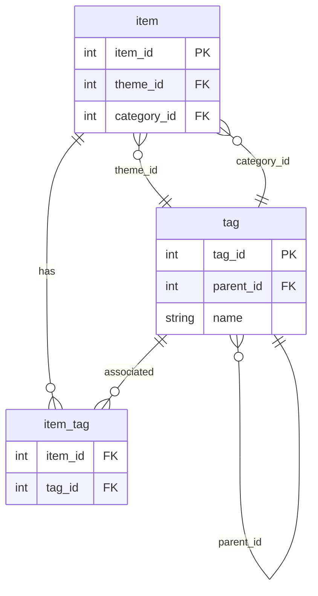

# Structurer son contenu : Modèle Thème / Catégorie + Tags libres

## 1. Objectif
À la fin de cette présentation, vous saurez comment concevoir un modèle d’information à la fois robuste et flexible, et comment le mettre en œuvre concrètement.

## 2. Modèle de données

### 2.1 Diagramme Entité–Relation


### 2.2 Structure détaillée

| Entité       | Clés                                   | Description                                                                                                                     |
|--------------|----------------------------------------|---------------------------------------------------------------------------------------------------------------------------------|
| **tag**      | `tag_id` (PK),<br>`parent_id` (FK),<br>`name` | - **Groupes de tags** (racines, `parent_id = NULL`) :<br>  • Thèmes<br>  • Catégories<br>  • Autres groupes libres optionnels<br>- **Tags fils** :<br>  • Thèmes : `parent_id = <tag_id de Thèmes>`<br>  • Catégories : `parent_id = <tag_id de Catégories>`<br>  • Tags libres : `parent_id = NULL` ou `parent_id = <tag_id d’un autre groupe>` |
| **item**     | `item_id` (PK),<br>`theme_id` (FK),<br>`category_id` (FK) | Chaque contenu (page, produit, article…) référencé à un tag fils du groupe Thèmes et à un tag fils du groupe Catégories |
| **item_tag** | `item_id` (FK),<br>`tag_id` (FK)       | Association N×N entre un **item** et ses **tags libres**                                                                           |

> **Note**  
> On distingue Thèmes et Catégories uniquement par leur appartenance au groupe racine via `parent_id`, sans champ supplémentaire.

## 3. Pourquoi ce schéma

1. **Clarté hiérarchique**  
   Les groupes racines (`parent_id = NULL`) déterminent les niveaux (Thèmes, Catégories, etc.), et les tags fils héritent de leur groupe.

2. **Souplesse éditoriale**  
   Ajouter, renommer ou supprimer un groupe ou un tag se fait uniquement dans la table `tag`, sans modifier la structure des contenus.

4. **Maintenance et évolutivité**  
   Toute évolution (nouveau groupe, nouveau tag) se gère via `tag.parent_id` sans toucher aux tables `item` ni `item_tag`.

5. **Analyse et pilotage**  
   Production de KPI par groupe de tags (Thèmes, Catégories, libre, etc.) et mesure de popularité des tags fils.

## 4. Bonnes pratiques de mise en œuvre

1. **Limiter le nombre de thèmes**  
   Compter entre 3 et 7 pour rester lisible.

2. **Catégorisation cohérente**  
   Prévoir 2 à 5 catégories par thème, avec des libellés explicites.

3. **Politique de tags libres**  
   - Règles de création (longueur minimale, casse, caractères autorisés).  
   - Formation des contributeurs pour éviter doublons et synonymes.

4. **Interface d’administration**  
   - Sélecteurs déroulants pour groupes Thèmes et Catégories (chargés depuis `tag`).  
   - Saisie auto‑complétée pour les tags libres (recherche sur `item_tag`).

5. **Expérience utilisateur**  
   - Menu principal structuré par thèmes.  
   - Filtres latéraux combinant catégories et nuage de tags libres.  
   - Suggestions « Vous aimerez aussi » basées sur les cooccurrences de tags libres.

## 5. Exemples de sites 

Pour chaque site :  
**Nom de domaine**  
- Thèmes : …  
- Catégories : …  
- Tags libres : …  
- Groupes de tags personnalisés : …

1. **equitablecart.eco**  
   - Thèmes : Commerce équitable, Zéro déchet, Réduction carbone  
   - Catégories : Vegan & cruelty‑free; Artisanat solidaire; Upcycling  
   - Tags libres : Fair Trade; Production locale; Inclusion salariale; Zéro waste; Économie circulaire; Transparence; Commerce solidaire; Éco‑conception; Responsabilité sociale; Recyclage  
   - Groupes de tags personnalisés :  
     - **Certifications** (Fairtrade, BCorp, Ecocert)  
     - **Origine** (Local, International)

2. **luxeemporium.com**  
   - Thèmes : Luxe, Exclusivité, Nouveautés  
   - Catégories : Collection capsule; Édition limitée; Best‑sellers  
   - Tags libres : Luxe; Exclusivité; Tendances; Collection capsule; Édition limitée; Pré‑commande; Marque premium; Artisanat haut de gamme; Sur‑mesure; VIP  
   - Groupes de tags personnalisés :  
     - **Fourchette de prix** (Standard, Premium, Ultra‑premium)  
     - **Provenance** (France, Italie, Autres)

3. **guiltypleasure.shop**  
   - Thèmes : Guilty Pleasures, Craquage nocturne, Regrets assurés  
   - Catégories : 2 h du matin finds; Panier fatal; Deals qu’on regrette pas  
   - Tags libres : Trop stylé; Paye maintenant réfléchis plus tard; No retour possible; FOMO; Achat impulsif; Minimisation des regrets; Craquage nocturne; Plaisir coupable; Offres flash; Tentation  
   - Groupes de tags personnalisés :  
     - **Moment d’achat** (Flash sale, Nuit)  
     - **Budget** (Économe, Indulgent)

4. **solidarityjourneys.org**  
   - Thèmes : Tourisme durable, Autonomisation, Respect des savoir‑faire  
   - Catégories : Séjours volontaires; Éco‑lodges; Itinéraires bas carbone  
   - Tags libres : Permaculture; Coopératives locales; Protection des traditions; Tourisme responsable; Impact social; Volontariat; Agroécologie; Équité; Culture locale; Réciprocité  
   - Groupes de tags personnalisés :  
     - **Durée** (Court séjour, Long séjour)  
     - **Public cible** (Familles, Étudiants)

5. **resortescapade.com**  
   - Thèmes : Tout‑inclus, Croisières de luxe, Resorts 5 étoiles  
   - Catégories : Clubs de vacances; Excursions packagées; Service VIP  
   - Tags libres : All‑inclusive; Excursions groupées; Transferts privés; 5 étoiles; Buffet à volonté; Spa; Divertissement; Confort absolu; Croisières; Luxe  
   - Groupes de tags personnalisés :  
     - **Type de séjour** (Farniente, Aventure)  
     - **Saison** (Été, Hiver)

6. **wanderfail.fun**  
   - Thèmes : Survival Trip, FOMO garanti, Instagram Only  
   - Catégories : Selfies & filtres; Hôtels improbables; Fails de voyage  
   - Tags libres : No Wi‑Fi no problem; Check‑in épique; Touriste relou; Insta‑worthy; Story garantie; Aventure extrême; Instafail; Fun; Partage viral; Humour décalé  
   - Groupes de tags personnalisés :  
     - **Niveau de difficulté** (Facile, Extrême)  
     - **Équipement** (Essentiel, Premium)

7. **artforchange.org**  
   - Thèmes : Art activiste, Droits humains, Féminisme intersectionnel  
   - Catégories : Installations participatives; Documentaire visuel  
   - Tags libres : Intersectionnalité; Antiracisme; Inclusion neurodiverse; Art engagé; Performances; Ateliers citoyens; Éducation artistique; Résistance; Expression collective; Solidarité  
   - Groupes de tags personnalisés :  
     - **Technique** (Installation, Performance, Vidéo)  
     - **Public visé** (Jeunes, Communautés locales)

8. **galleryelite.com**  
   - Thèmes : Commandes corporate, Décoration haut de gamme  
   - Catégories : Portraits de famille; Paysages pittoresques  
   - Tags libres : Vente en galerie; Tirage limité; Commission privée; Art contemporain; Collection privée; Œuvres originales; Sculpture; Peinture; Événements exclusifs; Prestige  
   - Groupes de tags personnalisés :  
     - **Medium** (Peinture, Sculpture, Photo)  
     - **Disponibilité** (En stock, Sur commande)

9. **fridgegallery.today**  
   - Thèmes : Art de frigo, Doodle existentialiste, WTF Statements  
   - Catégories : Post‑it Masterpieces; Gribouillis assumés; Œuvres en cours  
   - Tags libres : Champion du café tâché; Van Gogh wannabe; Chef‑d’œuvre or not; Art spontané; Créativité quotidienne; Esquisses; Humoristique; Micro‑art; Fun; Défi doodle  
   - Groupes de tags personnalisés :  
     - **Matériaux** (Papier, Post‑it, Aimant)  
     - **Style** (Doodle, Abstrait, Figuratif)

10. **justicejournal.social**  
    - Thèmes : Justice sociale, Transition écologique, Droits civiques  
    - Catégories : Mobilisations citoyennes; Innovations vertes  
    - Tags libres : Black Lives Matter; Éco-transition; Inclusion numérique; Égalité des chances; Liberté d’expression; Participation; Éducation civique; Solidarité; Engagement; Responsabilité  
    - Groupes de tags personnalisés :  
      - **Type d’action** (Protestation, Lobbying, Sensibilisation)  
      - **Thématique secondaire** (Numérique, Santé, Éducation)

11. **marketwatchdaily.com**  
    - Thèmes : Valeurs traditionnelles, Libéralisme économique  
    - Catégories : Économie de marché; Sécurité & ordre public  
    - Tags libres : Défense des frontières; Baisse d’impôts; Famille traditionnelle; Croissance; Entrepreneuriat; Concurrence libre; Politique fiscale; Patriotisme; Ordre social; Marché  
    - Groupes de tags personnalisés :  
      - **Secteur** (Finance, Énergie, Technologie)  
      - **Région** (Amérique, Europe, Asie)

12. **rumorroundup.press**  
    - Thèmes : Breaking Gossip, Fake News approuvées, Choc & Sidération  
    - Catégories : Scandales people; Tweet controversé; Rumeurs croustillantes  
    - Tags libres : OMG WTF; Vu sur TikTok; C’est pas moi qui le dis; Clickbait; Scoop; Buzz; Exclusif; Controverse; Potins; Viralité  
    - Groupes de tags personnalisés :  
      - **Origine** (Twitter, TikTok, Instagram)  
      - **Statut** (Confirmée, Non confirmée)

13. **learnforall.education**  
    - Thèmes : Pédagogie anti-biaisée, Accessibilité universelle  
    - Catégories : Cours multilingues; Ateliers co‑créatifs  
    - Tags libres : Neurodiversité; Handicap visuel; Égalité des genres; Inclusion; Adaptation; Apprentissage personnalisé; Discrimination positive; Diversité culturelle; Technologies assistives; Collaboration  
    - Groupes de tags personnalisés :  
      - **Niveau** (Débutant, Intermédiaire, Avancé)  
      - **Format** (Vidéo, PDF, Quiz)

14. **testprepplus.com**  
    - Thèmes : Préparation aux concours, Classements académiques  
    - Catégories : Cours magistraux; Examens blancs; Tables de classement  
    - Tags libres : Notes obligatoires; Top 10 national; Accréditation ministérielle; Tutorat; Simulations; Performance; Certification; Orientation; Stratégie d’examen; Résultats  
    - Groupes de tags personnalisés :  
      - **Matière** (Mathématiques, Littérature, Sciences)  
      - **Type d’exercice** (QCM, Dissertation, Oral)

15. **procrastischool.fun**  
    - Thèmes : Apprends en matant Netflix, Procrastination Boostée  
    - Catégories : 5 min chrono; Tutoriels YouTube Only; Quiz en pyjama  
    - Tags libres : Hack ton cerveau; Niveau noob only; Exam Cheats; Apprentissage ludique; Temps libre; Astuces rapides; Format court; Divertissement éducatif; Chill & learn; Instantané  
    - Groupes de tags personnalisés :  
      - **Durée** (5 min, 10 min, 15 min)  
      - **Plateforme** (Netflix, YouTube, Podcasts)

## 6. Avant / Après

| Aspect      | Avant (non structuré)             | Après (Thème/Catégorie + Tags libres)                |
|-------------|-----------------------------------|------------------------------------------------------|
| Recherche   | Texte libre, résultats aléatoires | Filtres hiérarchiques + suggestions par tags libres  |
| Maintenance | Nouvelles colonnes à chaque ajout | Création et gestion des tags libres en libre-service |
| Analyse     | Données peu exploitables          | Rapports par groupe, thème, catégorie et tags libres |

## 7. À vous de jouer
En **5 minutes**, définissez :  
1. **3 thèmes**  
2. **2 catégories** par thème  
3. **8 tags libres** clés  

Cette structure vous guide pour construire un système clair, robuste et évolutif. À vous d’innover !
```
